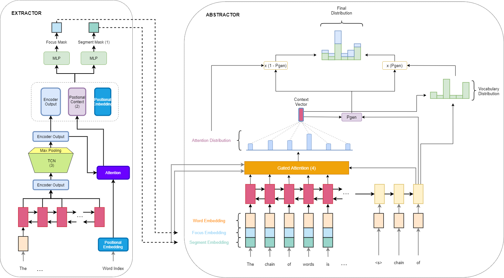

## IMPROVING ABSTRACTIVE SUMMARIZATION WITH SEGMENT-AUGMENTED AND POSITION-AWARENESS (ACLing2021)

Aurhors: Phuc Minh Nguyen and Thao Nhi Tran

### Overview Architecture


### Usage

`pip install -r requirements.txt`

### Data

```sh
# Download preprocessed data at ./squad/, ./cnndm/ and ./glove/ respectively
wget https://www.dropbox.com/s/dl/0gtz5ckh3ie55oq/emnlp2019focus_redistribute.zip

# Generate train_df.pkl, val_df.pkl, test_df.pkl and vocab.pkl at ./cnndm_out/
python CNNDM_data_loader.py
```

Details of dataset source are at [Dataset_details.md](Dataset_details.md)

### Train

1. Abstract Summrization

```sh
python train.py --task=SM --model=PG --load_glove=False --data=cnndm \
    --batch_size=16 --eval_batch_size=16 \
    --use_focus=True --n_mixture=1 --decoding=beam  \
    --load_ckpt=-1
```

### Evaluation

1. Abstract Summrization

```sh
python evaluate.py --task=SM --model=PG --load_glove=False --data=cnndm \
    --batch_size=16 --eval_batch_size=64 \
    --use_focus=True --n_mixture=1 --decoding=beam \
    --load_ckpt=3 --eval_only
```

### Result

- Results on the CNN/DM dataset

| Model         | R1        | R2        | RL        |
| ------------- | --------- | --------- | --------- |
| PG            | 39.53     | 17.28     | 36.38     |
| Bottom-Up     | 41.22     | 18.68     | 38.34     |
| SELECTOR      | 41.72     | 18.74     | 38.79     |
| SEGMENT       | 42.10     | 19.24     | 38.80     |
| SEGMENT + TCN | **42.20** | **19.25** | **38.86** |
